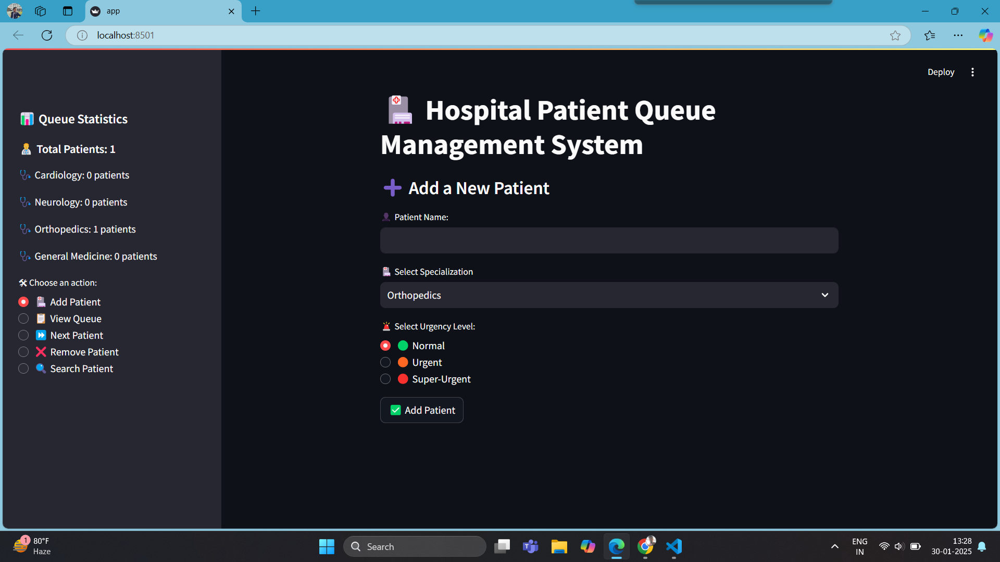

# OOPs-projects

## 🏥 Hospital Patient Queue Management System

📌 Project Overview
I developed the Hospital Patient Queue Management System, a Python-based command-line and Streamlit web application designed to efficiently manage hospital queues. It follows Object-Oriented Programming (OOP) principles and consists of three main components:

Patient – Represents individual patients with urgency levels.
Specialization – Manages queues for different hospital specializations.
OperationsManager – Handles patient queue operations (adding, removing, and retrieving).
This project ensures priority-based patient handling, providing an efficient workflow for hospitals.

-- Features
✅ Command-Line & Web-Based System – Works both as a CLI tool and an interactive web app.
✅ Patient Prioritization – Supports urgency levels (Normal, Urgent, Super-Urgent).
✅ Multiple Specializations – Separate queues for Cardiology, Neurology, Orthopedics, and General Medicine.
✅ Live Queue Management – Add, remove, or retrieve patients dynamically.
✅ Search Functionality – Quickly find a patient in the queue.
✅ Queue Statistics Dashboard – View real-time patient numbers in each department.
✅ Attractive Streamlit UI – Enhanced user experience with icons, colors, and clean layout.

⚙️ How It Works?
1️⃣ Backend Logic (OOP Implementation)
The project consists of three main classes that handle patient queue operations:

Patient Class: Stores patient information like name and urgency level.
Specialization Class: Manages patient queues for different hospital departments.
OperationsManager Class: Handles adding, removing, listing, and retrieving patients from queues.
This system allows hospitals to prioritize urgent cases and maintain a structured patient queue.

Streamlit Web App (Interactive UI): 
A user-friendly web interface was built using Streamlit to enhance accessibility. This version provides:

Sidebar Navigation – Users can easily switch between actions.
Live Queue Management – Patients remain in the queue unless removed.
Real-Time Statistics – Displays the number of patients in each specialization.
Search Functionality – Quickly locate a patient in any specialization queue.
Better UI with Icons & Colors – A visually appealing and intuitive experience.

## 📸 Screenshots  

### 🏥 Home Page  
  

Check out the images for fast understanding about this project!! 

https://github.com/Ritikgit789/OOPs-projects/tree/f25b6317908c868371b70111518daeb94edd57cf/Images

🤝 Contributing
Contributions are welcome! If you have ideas or improvements, feel free to open an issue or submit a pull request.
